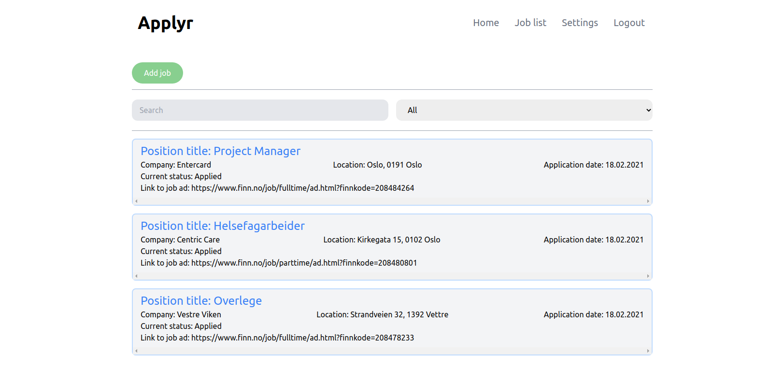

# Applyr app
The applyr app is used for aiding people who are searching for jobs to be organized. 

## Features
- List of all jobs applied to
  - Filtering
  - Searching
- Adding new job applications
  - Upload CV and cover letters
- Data backup

## Screenshot


## Installation
### Instructions to install
- ```git clone https://github.com/andersbjorklundjensen/applyr-app.git```
- ```cd applyr-app```
- ```sudo docker-compose --file prod-docker-compose.yml up --build```

#### Environment variables

### How to run tests
#### Cypress
#### Backend unit tests


## Technologies used for this project
### Backend
- Express - Web framework for NodeJS
- JWT - Authentication method
- Supertest - Http endpoint testing library
- Mocha - Testing framework
- Istanbul - Unit-test coverage

### Frontend
- ReactJS
- Bootstrap
- Styled Components
